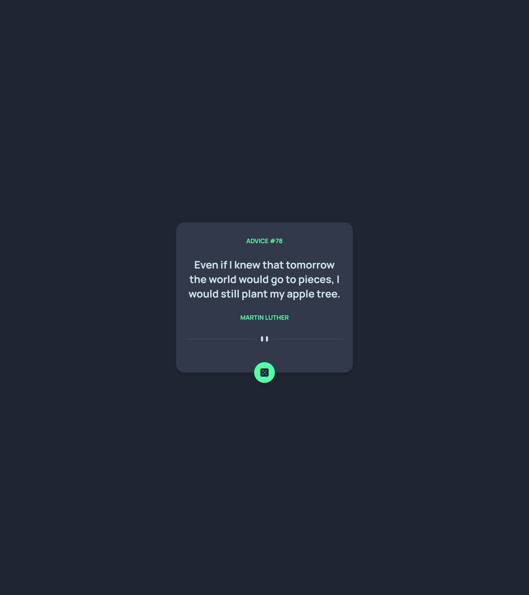

# Frontend Mentor - Advice generator app solution

This is a solution to the [Advice generator app challenge on Frontend Mentor](https://www.frontendmentor.io/challenges/advice-generator-app-QdUG-13db). Frontend Mentor challenges help you improve your coding skills by building realistic projects.

## Table of contents

- [Overview](#overview)
  - [The challenge](#the-challenge)
  - [Screenshot](#screenshot)
  - [Links](#links)
- [My process](#my-process)
  - [Built with](#built-with)
- [Author](#author)

## Overview

### The challenge

Users should be able to:

- View the optimal layout for the app depending on their device's screen size
- See hover states for all interactive elements on the page
- Generate a new piece of advice by clicking the dice icon

### Screenshot

Add a screenshot of your solution. The easiest way to do this is to use Firefox to view your project, right-click the page and select "Take a Screenshot". You can choose either a full-height screenshot or a cropped one based on how long the page is. If it's very long, it might be best to crop it.

### Links

- Solution URL: [Add solution URL here](https://github.com/Gito125/advice-generator-app)
- Live Site URL: [Add live site URL here](https://advice-app-generator.web.app/)

## My process

### Built with

- Tailwindcss
- [React](https://reactjs.org/) - JS library

## Author

- Website - [Add your name here](https://www.iamgideon125.carrd.co)
- Frontend Mentor - [@yourusername](https://www.frontendmentor.io/profile/Gito125)
- Twitter - [@yourusername](https://www.twitter.com/Gito)
